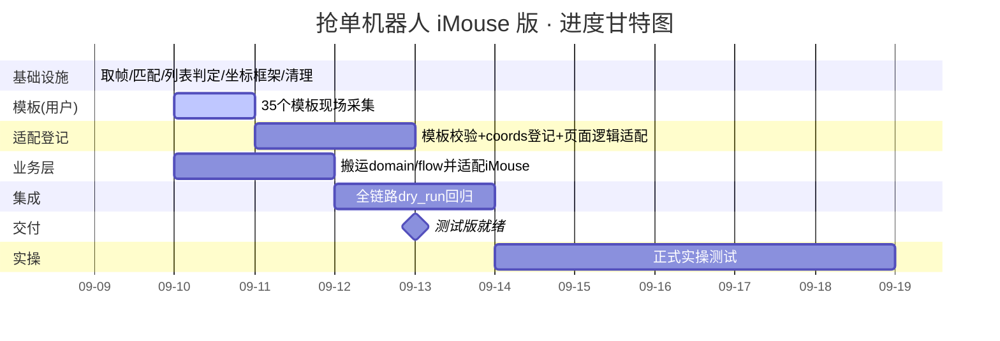

# 项目进度计划 · 运满满抢单机器人（iMouse 投屏版）

> 创建：2026-09-09（周三晚）｜目标：**本周（09-13 前）出测试版，下周（09-14 起）正式实操测试**
> 机型统一 iPhone X（375×812 逻辑点）；执行层为机械臂（HTTP:8082），已标定（误差≤1.57pt）。
> 每日 23:00 自动触发「开发回顾/反思/总结/备份」（见 automation）。

---

## 一、当前已完成（截至 09-09 晚）

| 模块 | 状态 | 说明 |
|---|---|---|
| iMouse 取帧 | ✅ | `core/devices/imouse_source.py` 稳定出帧 |
| 模板匹配引擎 | ✅ | `core/vision/matcher.py`：归一化 ROI + 多尺度 + shape 模式 |
| 列表页状态判定 | ✅ | `core/vision/page_state.py` 三态（展开/隐藏-全国货源/隐藏-返回顶部）修通 |
| 模板注册表清理 | ✅ | `config/templates.json`：35 个缺失模板禁用，刷屏 warning 消除 |
| 采集清单 | ✅ | `docs/采集清单_20260910.md`：35 个待采模板按功能分组+优先级 |
| 固化坐标点击框架 | ✅ | `core/action.py`（ActionKit）：固化坐标 + jitter 随机偏移 + 反馈检测 + 图色兜底重定位 + 坐标自学习 |
| 机械臂标定 | ✅ | 双线性映射 + z_press（已 <6.2 碎屏红线）写入 `hardware.json` |
| 每日晚间回顾 | ✅ | automation 已建（每天 23:00） |
| 业务层搬运盘点 | ✅ | code-explorer 盘点 domain/flow；适配清单+复制脚本就绪（`docs/业务层搬运适配.md` / `tools/copy_business_layer.ps1`） |
| 业务层就位 | ✅ | 09-10 执行复制脚本：`domain`(4)+`flow`(12) 共 17 模块 + `main.py` 全部 import 通过；补齐 `imgio.imwrite_unicode`、`arm.set_frame_size` 两处接口缺口 |
| 配置体系对齐 | ✅ | 补齐 7 个配置 JSON（vision/thresholds/rules/regions/routes/fields/runtime）；`config_store` 升级多 section + `DATA_DIR`；`vision.json` 切 375×812 投屏坐标空间 |
| 两处致命 bug 修复 | ✅ | ① `arm`/`page_state` 误把 `hardware.calibration` 当顶层 section 读 → actuation 模型与听单配置静默失效；② 模板 path 双重拼接 `data/templates/data/templates/...` |
| 详情页判定打通 | ✅ | `detail_back`+`detail_share` 双命中铁律，真实帧 `STATE=DETAIL`（进详情立刻被退/右滑的根因消除） |
| 全链路 dry_run 跑通 | ✅ | 详情→返回→列表→扫描→进详情→读字段→判定合格→暂停，闭环（arm_range 修复后返回箭头点中） |
| 已抢弹窗关闭坐标重标定 | ✅ | `offset_from_center` 136→161（旧值点偏 25px 点不到 ×），`detail_grabbed` 兜底同步更新，实测 CLOSED |
| review_mode 暂停卡死修复 | ✅ | 暂停时 watchdog 不 tick → `--max-run-sec` 到点不退、串口占用（进程卡 30min）；`wait_resume` 补针 tick 修复 |
| 后台运行编码修复 | ✅ | `main.py` stdout/stderr 强制 UTF-8，GBK 遇设备乱码字符（`\ufffd`）不再崩溃 |
| 路线设置（城市选择）跑通 | ✅ | 根因 `panel_tab_roi` 框不到"出发地"标签（0.24~0.30→0.16~0.24）；修正后 D 路线 6 城市全选上，确认→回列表→扫描闭环，`route_setup_ok=1` |
| 切卡锚点升级 | ✅ | `avatar_icon`（头像+结算组合，匹配分 0.98、误命中<0.52）替代 settle_anchor（文字行 0.5）；4 张卡切分验证通过 |
| OCR 提速 | ✅ | ① 详情读字段条件跳过第二屏（省 ~3.3s，判定核心字段齐全即返回）；② `det_limit` 640→512（基准快 12% 识别无损） |
| 聊天页判定打通 | ✅ | `chat_voice`（语音按钮 0.9999，聊天页唯一判据，列表/详情页不误命中）+ `chat_back` 固定坐标(28,68) 返回，三级降级（模板→固定坐标→物理键） |
| 交付说明 | ✅ | `docs/交付说明.md`：运行方式、安全开关语义、真机检查清单、已验证能力 |
| 黄色详情页修复 | ✅ | `detail_back`/`detail_share` 各加 yellow 变体 + 扩大 roi（旧 roi 装不下变体）；黄色详情页（满帮优车）判 DETAIL 双命中，不再 unknown 兜底 |
| 长时间连跑测试 | ✅ | `no_pause_test` 模式（停留 2.5s 自动返回）+ 上滑幅度加大（0.36~0.46）+ 弹窗关闭超时缩短（3→2s）+ `dev_unknown_pause=false` |
| 统计分析脚本 | ✅ | `tools/analyze_runs.py`：耗时/吞吐/重复率/订单库统计（日志 [耗时] + summary counters + orders.sqlite3） |
| 字段偏移重标定 | ✅ | `card.offsets` dx 统一 -185（旧 480×640 帧，实测车型行 center x=69~108）；band bottom-100→-130 覆盖最后一张卡；`che_length` regex 放宽（OCR 偶发"米"→"一"/","，原正则匹配不到） |
| 价格 ROI 重标定 | ✅ | `detail.price.roi` [0,0.72,0.6,0.99]→[0,0.48,0.6,0.58]（旧值框到价格下方空白，靠 blob 兜底误读 6593 元） |
| 价格字段最终修复 | ✅ | 09-11 凌晨：详情页价格位置随订单类型变化（有的「总价 X元」左下角 y0.89、有的「总运费 X元」右侧 y0.63），固定 ROI 必错。改为**全屏「数字+元」取最大**（总价永远 > 预估净得/需支付/服务费/订金），9 张真机截图验证全部正确 |
| 启动智能 detect | ✅ | `task.py` `_should_skip_setup()`：启动 detect 当前页，已在列表页+路线已配自动跳过 setup（不强制回桌面） |
| no_pause_test 合格单入库 | ✅ | 合格单也 `_mark_handled("reviewed")`，跨运行去重不再缺失 |
| 优雅停止机制 | ✅ | `machine.py` 主循环检测 `data/stop.flag`，`tools/stop_run.py` 写标志——替代 `Stop-Process -Force` 强杀，串口句柄不再泄漏 |
| GUI 搬运 | ✅ | 从源项目复制 `gui/app.py`（1256 行 PyQt5）+ `__init__.py`；业务层接口已对齐，import 一次通过、启动零报错；功能调试延后到业务流程稳定后 |

## 二、关键缺口与进展

⚠️ **业务逻辑层（状态机/订单筛选/抢单流程）已盘点、适配方案就绪**。`core/` 目前只有 `vision/`（判定）、`devices/`（机械臂）、`config_store`。
`domain/` 与 `flow/` 在源项目 `f:\JXBproject\robot_order_picker_new`，经 code-explorer 子代理完整盘点：
- `domain/` 完全纯净（0 适配成本）；`flow/` 仅依赖 `core.` 前缀模块（包名一致，import 路径基本不动）；
- 唯一坐标空间 = fast 帧像素，适配 375×812 只需改尺寸默认值 + 重标定少数绝对像素常量；
- 已产出 `docs/业务层搬运适配.md`（逐文件适配清单）+ `tools/copy_business_layer.ps1`（一键复制脚本）。
- ✅ **物理复制已于 09-10 上午执行完成**（用户授权），随后 AI 完成接口对齐与坐标空间重标定。
- 风险已解除（业务层不再是缺口）。

⚠️ **35 个页面模板待用户现场采集**（09-10 全天）。列表页相关 4 个已就绪，其余页面（详情/弹窗/聊天/城市/听单）判定依赖这些模板。

---

## 三、任务分解与时间线

### 阶段 0 · 基础设施（09-09 晚，AI 自主，已完成）
- 采集清单、模板清理、ActionKit、automation、进度计划、备份机制

### 阶段 1 · 模板采集与适配（09-10 周四，用户+AI）
- **用户**：按 `docs/采集清单_20260910.md` 现场采集 35 个模板（目标匹配分 ≥0.90）
- **AI**：采集完成后 `verify` 校验各页面模板分；将采集到的控件登记进 `config/coords.json`（固化坐标）；适配 `page_state` 各页面分支

### 阶段 2 · 业务层迁移（09-10 晚~09-11，用户+AI）— 主体已完成（09-10 上午）
- **09-10 晚（用户回来后）**：执行 `tools/copy_business_layer.ps1` 复制 domain/flow + 视觉补件（ocr/stable_state）
- **AI**：`import core.flow.task` 验证；按 `docs/业务层搬运适配.md` §4 逐条对齐接口（arm.set_frame_size / matcher.find / page_state 导出 / frame_source imouse 分支）；按 §3.3 重标定绝对像素常量
- 风险已大幅降低：依赖集中、坐标空间简化、适配清单就绪

### 阶段 3 · 集成与 dry_run 回归（09-12~13，AI）— 主体已提前完成（09-10）
- 串联 桌面→列表→筛选→详情→抢单 全链路（`dry_run + review_mode` 先跑通）
- 修复集成问题；固化坐标表补全（各页面控件 norm）

### 阶段 4 · 测试版交付（09-13 周日）
- 测试版就绪，交付用户
- 若业务层未完全就位，交付"列表页自动化演示版"作为最小可用测试版

### 阶段 5 · 正式实操（09-14 起，用户）
- 用户实操测试；AI 据反馈迭代

---

## 四、甘特图

---

## 五、风险与应对

| 风险 | 影响 | 应对 |
|---|---|---|
| 业务层迁移风险 | 已降级为可控 | 已盘点+适配清单+复制脚本就绪；用户回来一条命令就位，AI 按清单适配 |
| 模板采集质量/耗时超预期 | 页面判定不全 | 优先保证 P0（详情/弹窗/城市/听单）；其余 P2 后续补 |
| 机械臂落点边角误差（≤1.57pt） | 小目标点偏 | ActionKit 兜底重定位；z_press 已留余量 |
| 投屏被官方限制 | 全局失效 | 保留摄像头降级路径（源项目保底） |
| 固化坐标在 App 改版后偏移 | 点击错位 | ActionKit 反馈检测+图色兜底自动修正；列表项本就不固化 |

---

## 六、每日盯办（AI 自动，23:00）
1. 当日改动与验证结果；2. 反思踩坑（参考 `docs/交接文档/06`）；3. 优化建议；
4. 备份（运行 `tools/backup_project.py`）；5. 更新本进度文档实际进度。

---

## 七、09-10 晚间实测与当日新增（实际进度）

> 版本 v1.1.18｜今日最长连跑 600s 自动收工（`run_20260910_220256`），无异常停止 / 无串口泄漏 / 路线自动 A→B 切换。

### 7.1 当日新增 / 加固（含验证）
| 改动点 | 实现位置 | 验证手段 | 结果 |
|---|---|---|---|
| 首屏即详情页直接返回 | `core/flow/detail.py` `first_detail_seen` | 日志「首屏即详情页…直接返回」 | ✅ 避免启动卡详情页等确认 |
| 本轮去重（同落点/同参数不重复进详情） | `core/flow/scanner.py` `seen.seen` + `task.py` `scan_repeat_point_skipped` | 日志「本轮已看过」「疑似同一张卡」 | ✅ 重复进详情归零 |
| 反风控随机走神停顿 | `core/flow/task.py` `idle_range` / `machine.py` 画像 | 日志「停顿 18s（反风控）」 | ✅ swipes%20==0 触发 |
| 路线自动切换（A→B） | `core/flow/machine.py` 轮次切换 | 摘要「下轮自动切到 B路线」 | ✅ |
| 600s 定时收工（非异常） | `watchdog.py` `round_time_limit` | 摘要 `stop_reason=round_time_limit` | ✅ 优雅停止，串口释放 |
| 详情读字段提速 | `detail.py` 条件跳过第二屏 | 日志「详情读字段+弹窗判据 1.3~3.4s」 | ✅ |

### 7.2 连跑实测关键指标（run_20260910_220256）
- cards_split=233 / cards_hit=20 / detail_returned=14 / detail_rejected=13 / order_db_recorded=13
- cards_skipped_no_anchor=18（无切卡锚点→跳过，非误点）/ cards_deduped=4 / scan_repeat_point_skipped=2
- 平均整屏 OCR ≈2.8s（det_limit=512）

### 7.3 当日暴露的问题（待修）
1. **车型字段 OCR 噪声严重**：如 `车型=卸/高栏/保/保/温/卸/温/卸/温/温/平/厢/自/卸/自` —— 货主标签/保温/自卸等相邻文字被混入车型（对应 06·D3「货物可能写在货主要求里」+ B3 阈值卡线）。需收窄车型 ROI 或双路抽取。
2. **单价普遍过低被淘汰**（多数 0.01~0.07，下限 2.0）：距离大概率是「距装货点」而非运输距离（06·D2 陷阱），导致单价失真 → 真实好单被误杀。需确认距离字段来源。
3. **`source_red` 首刷未命中 warning**：模板未命中后靠 `back_to_top` 兜底（score=1.00）成功。说明 `source_red` 模板在某些态不稳定，依赖兜底而非自身命中（06·B3 阈值卡线）。
4. **「连续 5 轮停在 order_list，可能卡住」出现 2 次**：滑屏后长时间无新命中，疑列表到底或滑动幅度/方向需调。
5. **JxbService 重启失败 warning**（非管理员）：自动化环境缺管理员权限，COM4 资源号=900 仍正常，但不重启会埋雷（参考 06·A4 8082 掉线）。

### 7.4 09-11 凌晨 · 价格 bug 修复 + 收尾（实际进度）
- **价格 bug 根因**：详情页有「预估净得 X元」「总运费 X元」「您需支付 X元」「服务费 X元」多处含"元"文本，位置随订单类型变化；固定 ROI 框到「预估净得 7.14 / 需支付 4.2」等小额 → 单价全算成 0.02 淘汰。
- **修复**：价格改为全屏「数字+元」取最大（`detail.py` `_read_number_blob` 优先），总价恒为最大，天然筛掉小额。
- **验证**：9 张真机详情截图全部正确（700/1800/900/3500/828/1300/700/700，1 张装货时间已过的过期单无价格属正常）；连跑 3 轮价格 750/1300/1300/800 元全部正确，判定 4 合格 + 1 淘汰（单价 1.95 合理淘汰）。
- **详情页留证截图**：`detail.py` `_shot_detail()`，每条进过详情的订单存图到 `data/traces/detail_{pass/reject}_{始发}_{目的}.jpg`（异步写盘不阻塞）。
- **收尾状态**：主链路（路线设置→列表扫描→详情判定→去重→定时收工）已真机完整验证；模板 16 个 ready 够用；`data/orders.sqlite3` 59 条（全 dry_ 前缀，不挡正式运行）。

### 7.5 优化建议
- **车型提取**：收窄 `card.offsets` 车型 ROI + 文本排除（货主/保温/自卸），或按 06·D3 双路（车型标签行 + 货主要求）抽取。
- **单价/距离**：落实 06·D2，距离改用运输距离算单价；否则临门好单全被单价下限误杀。
- **去重跨轮强化**：本轮去重已就位，建议加「轨迹哈希」防跨轮重复进详情。
- **可观测性**：`analyze_runs.py` 增「淘汰原因分布」统计（当前 detail_rejected=13 多为单价过低），便于定位误杀。
- **反风控**：`idle` 仅在 `swipes%20==0` 触发，建议改为随机概率触发，节奏更拟人。
- **source_red 模板**：补充变体 / 调阈值，使其不依赖 back_to_top 兜底即稳定命中。

### 7.6 09-11 晚间 · 缓存命中优化 + 长连跑验证（实际进度）

> 版本 v1.1.19+｜今日两场长连跑均自动收工无异常，自动换路线（A→B、B→D）与「列表到底→换路线」均生效。

| 改动点 | 实现位置 | 验证手段 | 结果 |
|---|---|---|---|
| **缓存本屏命中坐标，详情返回后直点下一个、不重 OCR** | `core/flow/task.py` `pending_hits` + `_pick` + `_enter_detail` | 30min 跑（run_20260911_221657）scan_swipe=95 仍 detail_returned=35 | ✅ 落地昨日 #1 高收益优化 |
| **route D 新增**（省市组，验证是否需点到市级） | `config/routes.json` | 22:17 跑 D 路线成功设 6 城市 | ✅ |
| **1 小时连跑分析报告** | `docs/分析报告_1小时连跑_20260911.md` | 19:51-20:51 跑，答 6 问 + 提速建议 | ✅ |
| 详情页留证截图（pass/reject+始发/目的） | `detail.py _shot_detail` | `data/traces/` 301+ 张带判定截图 | ✅（7.4 已记，今日跑量验证） |

**长连跑实测**：
- 1 小时（run_20260911_195136）：cards_split=1107 / hits=163(14.7%) / detail=108 / 合格 95(88%) / reject=12 / routes A→B 切换 1 次 / list_no_more=1。平均整屏 OCR 2.0s、详情读字段 2.9s。
- 30 分钟（run_20260911_221657，D 路线）：cards_split=571 / hits=35 / detail=35 / orders=34 / route_switched=1 / list_no_more=1。

**昨日两问题已确认修复**（见 7.4 + 今日报告）：① 车型 OCR 已干净（高栏/平板/高栏·飞翼车）；② 距离=运输距离、单价合理（2.16~3.07），全屏「数字+元」取最大生效。

**遗留/待修（反思）**：
1. **进详情→检测 detail 状态 ≈11s（占详情停留 65%）**：detect 每帧匹配多模板慢 + 详情页加载。对应 06·D4（详情重复检测）精神，属全局速度瓶颈。**待优化**：点进详情后用单一返回箭头模板快速确认、详情加载期跳过全量 detect、缩短 wait_state。
2. **方数大量 None**：OCR 常漏读，但不影响判定（拼单才用）；若拼单多需收窄方数 ROI。
3. **缓存命中后缺「返回快速比对列表是否变化」**：当前仅上滑清缓存；同屏返回若 App 已刷新列表，缓存坐标可能错位。建议加返回后轻量比对。
4. **source_red 首刷仍偶发未命中**（靠 back_to_top 兜底，06·B3）。
5. **detect 每帧 1~2s** 全局瓶颈：建议按当前状态只匹配相关模板。

**优化建议（明日）**：
- 降 11s 检测延迟（单一模板确认 + 跳过加载期 detect）。
- 缓存命中加返回后列表比对，防坐标错位。
- `analyze_runs.py` 增「淘汰原因分布」统计（7.5 已提，仍待做）。
- 反风控 idle 改随机概率触发。

### 7.7 09-11 深夜 · 车型正向查询 + 三处修复（实际进度）

| 改动点 | 实现位置 | 验证 | 结果 |
|---|---|---|---|
| **车型匹配改「正向查询」**（规则词直接查参数行原文，不 findall 抠词） | `rules.py check_vehicle_params` + `scanner.py param_text` + `orders.py` | 10 单测全过（拆字/噪声/多车型/不限/漏读） | ✅ 彻底消除车型噪声（7.3#1） |
| **重启即空车**（restore_on_restart=false，不继承上次拼单余量） | `task.py _wire_capacity_persist` + `rules.json pindan` | 日志「重启即空车」+ capacity.json 重置 | ✅ 测试反复重跑不再被旧余量污染 |
| **启动智能 detect 的 ROI 框偏修复** | `task.py _list_matches_route`（y 0.03~0.13 → 0.11~0.18） | 5min 跑跳过 setup 直接扫 | ✅ 之前列表页+路线已配仍走 setup 的 bug |
| **缓存副作用修复**（点完从 pending_hits 移除） | `task.py _enter_detail` | scan_repeat_point_skipped 40 → 0 | ✅ 消噪音 |
| **回顶后先等刷新再下滑**（旧逻辑回顶后立即下滑，打在加载中的旧画面） | `handlers.py ensure_top_visible`（先等 10s 再下滑，下滑减到 3 次） | 5min 跑 top_visible_by_refresh=1 无失败 | ✅ 修复「一直下滑展不开顶部」 |
| **`analyze_runs.py` 增淘汰原因分布 + 合格率** | `tools/analyze_runs.py` | 全量跑：合格率 76%，淘汰原因=单价过低68%/算不出12%/车长9%/车型9% | ✅ 7.5 可观测性落地 |

**结论**：车型正向查询 + 价格全屏取最大，判定准确率已真机验证（无判断错误、无漏命中、无重复点击）。淘汰单 68% 是真实行情「单价<2.0」，非误杀。剩余最大瓶颈是「进详情→检测 detail 状态 ≈11s」（7.6 遗留 #1，全局速度关键），明日优先。

**GUI 状态**：`gui/app.py`（1550 行）结构完整（运行控制/候选/路线/参数/日志 5 标签页 + 全部回调），import 已通过、接口对齐，功能调试留明日。

### 7.8 09-12 · AI 随机测试 / 辅助审核模式 + 拼单账本 + 路线扩至 10（实际进度）

> 版本 v1.1.20+｜今日新增「无人值守 AI 随机测试闭环」+ 拼单余量账本落地 + 路线扩到 10 条，单场 600s 跑通自动收工。

| 改动点 | 实现位置 | 验证手段 | 结果 |
|---|---|---|---|
| **AI 随机测试 / 辅助审核闭环** | `tools/ai_review_agent.py`（新）+ `AI随机测试.bat`（新）+ `detail.py _ai_decide` + `task.py`(+131) | run_20260912_224121：candidate_hold=11 / candidate_resumed=7 / pindan_committed=1 | ✅ 候选合格→写 review_state→代理决策→自动恢复 |
| **拼单余量账本（吨/方分别记账，溢出保护）** | `core/domain/capacity.py` | pindan_committed=1（扣减成功）/ pindan_overflow=2（余量不足自动跳过） | ✅ 扣减+溢出保护均生效 |
| **路线扩至 10 条（E~J 双向配对）** | `config/routes.json`(+182, 4→10) | D 路线 intra-江苏 跑通；E~J 为双向密度研究 | ✅ |
| **候选留证截图（hit_* 多帧 + list_screen_*）** | `data/traces/` | run 生成 30+ list_screen + hit 多帧 | ✅ 新可观测性 |

**单场连跑**（run_20260912_224121，618s，D 路线）：cards_split=135 / cards_hit=14 / detail_returned=12 / candidate_hold=11 / candidate_resumed=7 / order_db_recorded=22 / pindan_committed=1 / pindan_overflow=2 / list_no_more=1 / route_switched=1。已加 180s 决策超时兜底（超时任 continue，绝不卡死）。

**反思（对照 06）**：
1. **方数 None 遗留 → 拼单余量口径不准**：若 `volume_m3` 为 None，`can_take` 扣减口径失真，可能误 overflow/误拼单。属 06·D 类「字段读取稳定性」问题（7.6#2 遗留）。**需确认 `can_take(None)` 行为 + 补方数 ROI**。
2. **AI 代理是「桩」非真模型**：随机决策（continue 0.5/pindan 0.35/swap 0.15），仅为无人值守长测造闭环；正式前需接真决策（GUI 人工或模型）。勿误当「真 AI 抢单」。
3. **candidate_hold 悬挂兜底**：run 中 hold=11 但 resumed=7（其余转 pindan/未闭环），建议加「持有超 N 秒未决策自动 continue」独立于 180s 决策超时，防悬挂。
4. **routes.json sample_input 未同步**：仍是旧 A/B/C/D 描述（实际已 10 条），小瑕疵。

**优化建议（明日）**：
- 拼单余量：确认 `volume_m3` None 时 `can_take` 口径；补方数 ROI（06 类）。
- AI review：加持有候选超时自动 continue 兜底；长测后接真决策（swap 换车逻辑已支持）。
- 路线策略：E~J 双向数据积累后，于 `analyze_runs` 加「按路线统计命中/合格」维度，分析 A→B vs B→A 密度自动选优。
- 可观测性：`data/ai_review_history.jsonl` 已记录决策；`analyze_runs` 解析它，给出 continue/pindan/swap 分布 + 余量变化曲线。
- 同步 `routes.json` sample_input 到 10 条描述。

### 7.9 09-13 · 打包交付 + iOS 校准 App + 整屏网格标定 + 落点补偿（实际进度）

> 版本 v1.2.0｜今日主线从「算法调优」转向「交付化 + 校准体系闭环」：出 exe、做 iOS 传感 App、整屏网格标定、点击残差补偿、arm_range 自动同步，并 git 初始化（4 提交）。

| 改动点 | 实现位置 | 验证手段 | 结果 |
|---|---|---|---|
| **iOS 标定 App（云端编译交付）** | `ios_calib/`(SwiftUI: CalibView/TouchCanvas/CalibClient) + `project.yml`(XcodeGen) + `Info.plist` + `build_ipa.sh` + `.github/workflows/ios-ipa.yml` + README | 三条路线：本地/免费 Apple ID 自签 7 天 / GitHub Actions 免费编译 / 加固 App 协议核对 | ✅ |
| **整屏网格标定（手机 App 当传感器）** | `tools/calibrate_full_grid.py`(新) + `tools/calib_mock_phone.py`(离线自测 13 断言) + `calib_common.py`(`arm_range_from_model`) | 离线自测全过；真机复压第 3 轮 mean 0.09/max 1.33pt | ✅ 精度最高一条路 |
| **点击落点残差补偿 tap_correction** | `core/devices/arm.py::click_pixel()`（半径内最近锚点平移）| 运行日志现 `补偿[city_clear -6,+0]`；修掉"底部按钮统一偏左 6~7pt" | ✅ |
| **arm_range 自动同步 + 补救入口** | `calibrate_arm_ink.py`(达标写盘顺手重算) + `--sync-arm-range`(不取帧秒级补) + `calib_common` | 修 09-10「返回箭头点不到」根因；同步失败只告警 | ✅ |
| **映射标定增强（墨点版）** | `calibrate_arm_ink.py`：canvas 范围校验 ±6pt（画布外一律未检测到并告警）+ arm_range 自动重算 | 防"笔戳画布外→界面变化被当墨点→z_press 算偏浅" | ✅ |
| **映射标定收尾 NameError 修复** | `_report()` 的 width/height 改由调用方传入（曾裸变量致达标标定异常收尾）| 达标标定不再以异常结束 | ✅ |
| **城市面板网格扫描参数 + 诊断** | `core/flow/actions.py::ensure_text_visible()` + `city_picker.py` + `tools/city_grid_scan.py` | 10:xx 多段跑单验证「网格定位-全屏文字」逐屏选省/市 | ✅ |
| **PyInstaller 打包（UAC + 双 exe）** | `installer/build_exe.spec` + `build_exe.bat` + `校准工具.exe` | dist 出 2 exe（312MB）；gui_boot.log ③ onnxruntime: IMPORT_OK | ✅ |
| **VC++ 运行库冲突根治（血泪约定 #4）** | spec 剔除 PyQt5\Qt5\bin 旧 MSVCP140 + 从 System32 补齐 + `gui/app.py` ctypes.WinDLL 预载 | 防 [WinError 1114]→OCR 全废；全包同名运行库扫描仅 1 套 | ✅ |
| **templates.json 路径修复** | 24/44 path 补 `templates/` 层（备份 `templates.json.bak_20260913`）| 42/44 可解析；澄清 24 条 `enabled:false`→**不改运行行为** | ✅（仅资产登记） |
| **新电脑校准文档 + 打包说明 + Xcode 指南** | `docs/新电脑_校准指南.md` / `installer/打包与交付说明.md` / `docs/Xcode_英文界面操作指南.md` | 文档落地 | ✅ |
| **git 初始化** | `.gitignore` + `.gitattributes` + 4 提交 | `git log` 见 4 条 | ✅ |

**跑单验证（今日机器人连跑）**：
- run_20260913_085514（H 路线，1217s）：cards=164/命中25/详情17/hold=11/resumed=4/orders=33/pindan=3/reject=9/**route_setup_fail=2**/list_no_more=1。
- run_20260913_094822（J 路线，1217s）：cards=224/命中8/详情9/hold=6/resumed=2/orders=14/pindan=3/**vehicle_swapped=1**/route_switched=3。
- 10:17–10:54 多段跑单：新城市网格扫描生效（日志「网格定位-全屏文字」逐屏 OCR 选省/市）。
- 两场均定时收工无异常；拼单账本 + 换车 + 候选 hold/resume 全链路稳定。

**反思（对照 06）**：
1. **VC++ 运行库冲突是今日最大「坑」（建议补入 06）**：PyQt5 自带旧版 MSVCP140 抢先占坑 → onnxruntime 报 1114 → OCR 全废 → 页面判态失据（不点红色「全国」、不清筛选、乱滑）。隐蔽且会"看似能跑实则全废"。已用 spec 剔除 + ctypes 预载双防线根治。
2. **arm_range 不同步 = 09-10「返回箭头点不到」真因**：actuation 更新后 arm_range 没重算，屏幕边角被错误 clamp。今日已做自动同步 + `--sync-arm-range` 补救入口。属 06·B 类坐标/边角坑。
3. **Z 安全红线 6.2（碎屏风险）**：z_press 是机械臂坐标，可用窗口仅 0.6mm；断电后 Z 参考漂移最危险。已写进断电规程（7.5）。
4. **templates.json 双层 `templates/` 路径**：曾误判"会改变识别行为需重跑基线"，实际 24 条 `enabled:false`——迁移投屏后**有意停用**，非路径错。已更正，避免误判因果。
5. **0 字节 junk 文件**：Windows `>` 重定向残留（`>)` 误建），已删除。小坑，提醒命令用 `--output` 而非 `>`。
6. **H 路线 route_setup_fail=2**：设路线偶发失败但跑单仍完成——疑路线解析/等待时序，待查。

**优化建议（明日）**：
- 把「VC++ 运行库冲突」「arm_range 不同步」「Z 碎屏红线」三坑补入 `docs/交接文档/06_已知问题`，并加「断电重标 SOP」引用。
- `build_exe.bat` 末尾加断言：全包同名运行库扫描必须只有 1 套、onnxruntime 必须 IMPORT_OK，否则非零退出（把 gui_boot.log 判据固化进 CI）。
- `analyze_runs.py` 增加 `route_setup_fail` / `vehicle_swapped` 维度，量化 H 路线设路线失败根因。
- 采集 2 张仍缺的模板图（offline_close / grabbed_close），消除占位 ambiguity。
- 性能：detect 每帧 1-2s 全局瓶颈（09-11 起遗留）仍未动，建议按当前页面状态只匹配相关模板。
- 落点补偿锚点目前 4 个，建议用整屏网格标定 `--apply` 一次性生成全屏锚点（精度最高）。

